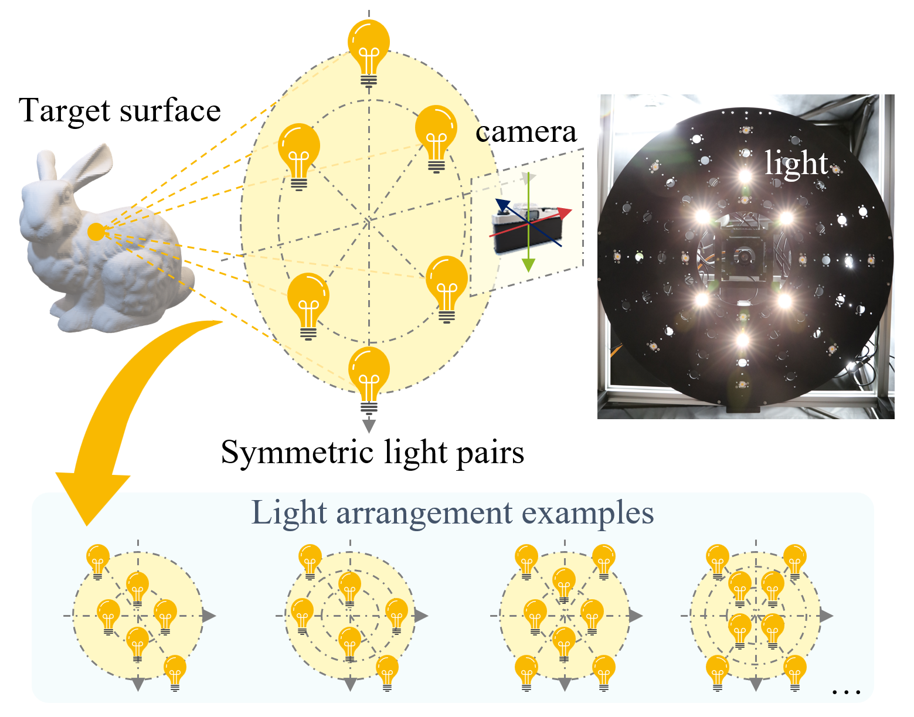
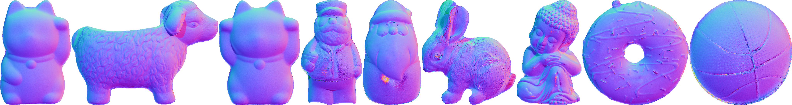

<table><tr><td align="center">

## Near-light Photometric Stereo with Symmetric Lights

**[Lilika Makabe](https://lilika-makabe.github.io/)** · **[Heng Guo](https://gh-home.github.io/)** · **[Hiroaki Santo](https://sites.google.com/view/hiroaki-santo/)** · **[Fumio Okura](http://cvl.ist.osaka-u.ac.jp/user/okura/)** · **[Yasuyuki Matsushita](http://www-infobiz.ist.osaka-u.ac.jp/en/member/matsushita/)**

This is the official implementation of our ICCP 2023 paper:
"Near-light Photometric Stereo with Symmetric Lights"



</td></tr></table>

### 📄 [Paper (arXiv:2603.16404)](https://arxiv.org/abs/2603.16404) | 📎 [Supplementary](https://drive.google.com/file/d/17PwXmgkpC_3exveSLr8Qh-AZMeaHcZNA/view?usp=sharing) | 📦 [Data](https://drive.google.com/drive/folders/11iIMdZODNjiyJEj3OAJtB-Q5U_D0B5y9?usp=sharing)

## 📝 Abstract

This paper describes a linear solution method for near-light photometric stereo by exploiting symmetric light source arrangements. Unlike conventional non-convex optimization approaches, by arranging multiple sets of symmetric nearby light source pairs, our method derives a closed-form solution for surface normal and depth without requiring initialization. In addition, our method works as long as the light sources are symmetrically distributed about an arbitrary point even when the entire spatial offset is uncalibrated. Experiments showcase the accuracy of shape recovery accuracy of our method, achieving comparable results to the state-of-the-art calibrated near-light photometric stereo method while significantly reducing requirements of careful depth initialization and light calibration.

## ⚙️ Environment Setup

### Option 1: Docker (Recommended)

Build the image, then run with your data directory mounted:

```bash
docker build -t nearlight-symps .
docker run --rm \
  -v $(pwd)/data:/workspace/data \
  -v $(pwd)/output:/workspace/output \
  nearlight-symps
```

This runs `scripts/run_solve.py` on all objects by default. To customize:

```bash
docker run --rm \
  -v $(pwd)/data:/workspace/data \
  -v $(pwd)/output:/workspace/output \
  nearlight-symps \
  python scripts/run_solve.py --n_jobs 8 --initial_resize 0.5
```

### Option 2: Local

Tested with Python 3.12 on Ubuntu 24.04.

```bash
pip install -r requirements.txt
```

## 📂 Data

Place captured data under `data/`:

```
data/
├── ball_undist/
│   ├── image/              # image_000.npy ~ image_008.npy
│   ├── mask.png
│   └── light_params.txt
├── buddha_undist/
└── ...
```

### `light_params.txt`

Specifies the symmetric light source arrangement. The first line is the number of light sources, followed by one line per light with two values: **radius** (signed distance from the symmetry center) and **angle** (rotation angle in degrees around the optical axis). Positive and negative radii represent a symmetric pair about the center. The smallest absolute radius should be normalized to 1.

Light positions are computed as `(r·sin(θ), r·cos(θ), 0)`. The coordinate system and angle convention:

```
          Z (into the scene)
         /
        /
       /
      +---------> X (θ=90°)
      |
      |θ\
      |  \
      v
      Y (θ=0°)
```

Example (`light_params.txt` for 8 lights — 4 symmetric pairs):
```
8
-1 90
 1 0
 1 90
-1 0
-2.2 135
 2.2 45
 2.2 135
-2.2 45
```

### Input images

Each `.npy` file in `image/` is a grayscale image captured under a single light source, stored as a NumPy array (`uint16`). The images should be sorted so that the order matches `light_params.txt`.

If one extra image is present beyond the number of lights (i.e., `n_lights + 1` images total), the **last image is treated as an ambient image** and is automatically subtracted from all other images before processing.

## ▶️ Run

Solve all objects:

```bash
python scripts/run_solve.py --n_jobs 8 --initial_resize 0.5
```

Solve a single object directly:

```bash
cd src && python solver.py ../data/ball_undist --output_dir ../output/ball_undist --n_jobs 8 --initial_resize 0.5
```

Results are saved to `output/<object>/`:
- `res.npz` — estimated depth, normal, albedo, scaled distances
- `normal_fromours.png` — normal map visualization

### Reproducing paper results

To reproduce the results from the ICCP 2023 paper, run with `--initial_resize 0.5`:

```bash
python scripts/run_solve.py --n_jobs 8 --initial_resize 0.5
```

### Results

Estimated normal maps (cat, sheep, svcat, sailor, santa, bunny, buddha, donut, ball):



## 📁 Project Structure

```
├── scripts/
│   └── run_solve.py          # Batch solve runner
├── src/
│   ├── solver.py             # Main entry point + Solver class
│   ├── constraints.py        # Constraint matrix builders (Eq. 1–4)
│   ├── distance_estimation.py # Per-pixel scaled distance estimation (SVD)
│   ├── point_estimation.py   # 3D point estimation via sphere intersection
│   ├── evaluate.py           # Evaluation and visualization
│   ├── dataset/
│   │   └── dataset_ours.py   # Dataset loader
│   └── utils/
│       ├── general_utils.py  # Parallel processing, PS solver, mesh export
│       ├── io_utils.py       # I/O helpers
│       ├── vis_utils.py      # Visualization helpers
│       └── log_util.py       # Logging setup
├── data/                    # Input data (not included in repo)
├── output/                  # Results (generated by solver)
├── requirements.txt
└── Dockerfile
```

## Citation

```bibtex
@inproceedings{makabe2023iccp,
  title     = {Near-light Photometric Stereo with Symmetric Lights},
  author    = {Lilika Makabe and Heng Guo and Hiroaki Santo and Fumio Okura and Yasuyuki Matsushita},
  booktitle = {IEEE International Conference on Computational Photography (ICCP)},
  year      = {2023}
}
```
